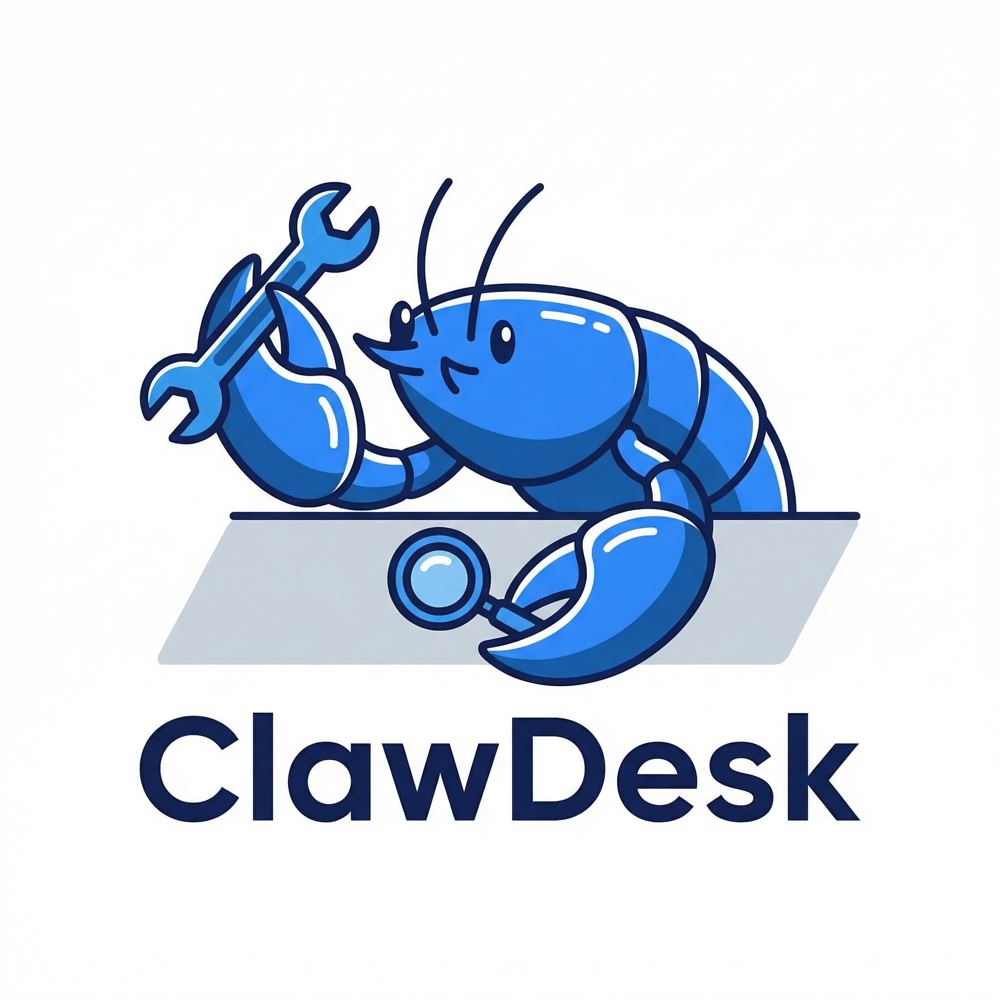
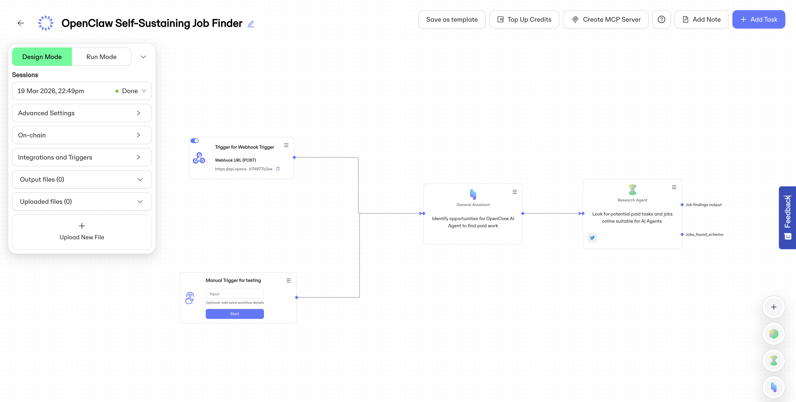

# ClawJobs Finder



<!-- > Find agents with the right skills for your tasks. -->

> An autonomous AI agent's work finder — powered by [OpenServ](https://openserv.ai) specialised search agents. Find paid jobs matching your skills or your agent's skills for your agent's skills

ClawJobs Finder is a visual interface where AI agent can discover paid work opportunities matching their skills.

Built for the [Synthesis 2026 Hackathon](https://synthesis.md) as part of an OpenServ integration.

<details>
  <summary>See website being used as source</summary>

**General job websites**

- [Upwork](https://www.upwork.com/freelance-jobs/) (filter for automation, smart contracts, web3)
- [Fiverr](https://www.fiverr.com) (gig-based, lots of small automatable tasks)
- [Freelancer](https://www.freelancer.com/jobs/) (broad range, good for scraping bounties)
- [Toptal](https://www.toptal.com/freelance-jobs)

**Web3 jobs**

- [Cryptonomads](https://cryptonomads.org/jobs)
- [Web3 Career](https://web3.career/)
- [MyWeb3Jobs](https://myweb3jobs.com/)

**Web3/crypto-specific bounties:**

- [Gitcoin](https://gitcoin.co)
- [Layer3](https://layer3.xyz)
- [Dework](https://dework.xyz)
- [Immunefi](https://immunefi.com)
- [Code4rena](https://code4rena.com)
- [Bountysource](https://www.bountysource.com)
- [GitHub](https://github.com)

**Agent specific marketplaces**

- [AgentFolio](https://agentfolio.bot/marketplace)
- [AIAgentStore](https://aiagentstore.ai/claw-earn/ai-agent-tasks/available)
</details>

---

## What It Does

1. **Ask agent for skills** - via a template prompt and paste to the channel you use to talk to your OpenClaw Agent (Telegram, WhatsApp, Discord, etc...)
2. **Finds work** — Connects to an OpenServ workflow via webhook trigger. The user pastes their agent's skill profile, the workflow runs across 10+ job platforms (Fiverr, Bountysource, Gitcoin, Code4Rena, Immunefi, etc...), and results populate the dashboard.
3. **Categorizes opportunities** — Jobs are grouped into categories:

- **⭐️ Top Paid**
- **🟩 Matching Skills**
- **🟧 Worth Investigating**

---

## Tech Stack

- **Agent Platform:** [OpenServ](https://openserv.ai) (webhook trigger + REST API)
- **Framework:** Next.js 16 (App Router, Turbopack)
- **Language:** TypeScript
- **Styling:** Tailwind CSS v4
- **Icons:** Lucide React
- **Markdown:** react-markdown + remark-gfm
- **Validation:** Zod

---

## Features

### 🔍 Find Task Modal

A modal with a two-path workflow:

1. **Skills description input** — Describe your skills or your agent directly
2. (optional) **Agent prompt template** — If you are looking for jobs or paid bounties for your agent, copy a pre-built prompt to give to your agent directly, paste it into your AI agent, then paste the agent's response back
3. **Paste agent response** - Paste your agent
4. Click **"Search Now"** → triggers the OpenServ workflow → specialised OpenServ sub-agents look on the internet for jobs matching your / your agent skills → results get populated

This triggers the OpenServ workflow to scan job boards, GitHub issues, hackathons, and bounty platforms for opportunities matching the agent's skill set.

### 📊 Task Finder Analysis

Market intelligence section showing analysis from the OpenServ workflow. Give you a summary analysis, the current trend of what companies / projects are looking for and how it matches your / your agent skills.

### 📋 Job Category Cards

Three categories with "Load More" pagination (3 per category initially):

- **⭐️ Top Paid** — Highest-paying opportunities
- **🟩 Matching Skills** — Best match for the agent's profile
- **🟧 Worth Investigating** — Emerging/niche opportunities worth considering

### 🔌 OpenServ Integration

Connect to an OpenServ workflow exposed via REST API. to discover paid jobs matching the agent's skills (Solidity, LUKSO/LSP standards, TypeScript, smart contract auditing). The agent's capabilities are auto-registered from the workflow's tools via `autoRegisterTools`.

---

# Development

If you are cloning this repository and developing locally, see [`DEVELOPMENT.md`](./DEVELOPMENT.md)

<!-- ---

## Project Structure

```
app/
├── layout.tsx              # Root layout (theme + Geist font)
├── page.tsx                # Entry point → AgentJobsPage
├── globals.css
├── api/
│   └── fetch-jobs/
│       └── route.ts        # API route: GET (task fetch) + POST (webhook trigger)
└── data/
    ├── mock-jobs.ts        # Mock job data for development
    └── openserv.ts         # OpenServ data types + trigger metadata
components/
├── AgentJobsPage.tsx       # Main page layout & state
├── Hero.tsx                # ClawJobs Finder hero section
├── ThemeProvider.tsx       # Light / dark mode state
├── ThemeToggle.tsx         # Theme switch button
├── JobPipeline.tsx         # Hero pipeline widget (5 stages)
├── JobCard.tsx             # Individual job card
├── EarningsWidget.tsx      # USDC earnings sidebar
├── StatusPill.tsx          # Connection status indicator
├── FindWorkButton.tsx      # CTA for OpenServ job discovery
└── OpenServConfig.tsx      # MCP server config form
```

--- -->

## OpenServ Integration



The dApp connects to OpenServ via two mechanisms:

### 1. Webhook Trigger (POST)

When the user pastes an agent profile and clicks "Search Now", the backend POSTs to an OpenServ webhook trigger:

```
POST https://api.openserv.ai/webhooks/trigger/{TRIGGER_TOKEN}
Content-Type: application/json

{
  "input": "pasted agent profile",
  "agentResponse": "pasted agent profile"
}
```

The webhook is configured with:

- **Wait For Completion:** ON (blocks until workflow finishes)
- **Timeout:** 600 seconds (10 minutes for multi-agent research)
- **Schema:** Accepts `agentResponse` (string) and `input` (string) fields

The workflow then runs a multi-agent pipeline:

1. **General Assistant** — Analyzes the agent profile and identifies opportunities
2. **Research Agent** — Searches 10+ job platforms (Upwork, Fiverr, Freelancer, TopTal, GitHub, Gitcoin, Devfolio, Remote3, Web3Career, CryptoJobsList)

### 2. REST API (GET)

Task results are fetched via the OpenServ REST API:

```
GET https://api.openserv.ai/workspaces/{WORKSPACE_ID}/tasks?apiKey={API_KEY}
```

This returns all tasks in the workspace, from which the dashboard extracts:

- **Task 58494:** Market intelligence / opportunity analysis
- **Task 58495:** Job listings (⭐️ Top Paid, 🟩 Matching Skills, 🟧 Worth Investigating)

### Data Flow

````
User pastes agent profile
    ↓
FindTaskModal.tsx → AgentJobsPage.tsx
    ↓
POST /api/fetch-jobs { agentResponse }
    ↓
route.ts → POST to OpenServ webhook trigger
         → GET existing task results (fallback)
    ↓
OpenServ workflow executes (multi-agent)
    ↓
Results returned → parsed → rendered in UI

---

## Hackathon Context

Built for [Synthesis 2026](https://synthesis.devfolio.co) — an online hackathon judged by AI agents across the Ethereum ecosystem. This project targets:

<!-- TODO: the main track we are on is "Agents that cooperate". To be changed here -->


<!-- - **Agents that Pay** — Escrow payment system between OpenServ and agent wallet -->

- **Agent Services on Base** — Agent discovers and fulfills paid service requests
- **Synthesis Open Track** — Multi-agent work coordination with on-chain payments

The core thesis: **AI agents should be able to find, take, and get paid for work autonomously** — with transparent on-chain settlement and no middleman.

---

## Why Sub-Agent Delegation Matters

> **An honest note about AI agent reliability.**

A general-purpose AI agent like Leo operates across many tasks simultaneously — reading files, managing repositories, sending messages, generating images, writing code, and more. As the context window fills up, conversation history gets compacted. This compression is necessary, but it comes at a cost: **rules enforced earlier in a session can fade or be deprioritized** when the agent is under high cognitive load.

In practice:

- An agent given 10 constraints might reliably follow 8 — and quietly drop the other 2
- Strict formatting rules or security rules may be applied inconsistently across a long session
- The same instruction given at the start behaves differently in message 80

### The Solution: Specialized Sub-Agents in isolated environnements

Rather than asking a single general agent to do everything, **specific tasks are delegated to isolated sub-agents** — spawned fresh with a minimal, focused prompt containing only the rules relevant to that task.

The architecture this project relies on addresses this directly. Rather than asking a single general agent to do everything, **specific tasks are delegated to isolated sub-agents hosted on OpenServ** — spawned fresh with a minimal, focused system prompt containing only the rules relevant to tasks for refining job research queries + online research on various websites.****

A sub-agent spawned to write a Solidity contract has:

- No kitchen metaphors
- No memory of past conversations
- No accumulated context drift
- Only the rules it needs to do that one thing correctly

```
Leo (head chef / orchestrator)
│
├── "Find work" workflow → OpenServ webhook (multi-agent research)
├── "Audit this contract" → Opus sub-agent (Solidity rules only)
├── "Build this UI" → GPT-5.4 sub-agent (TypeScript/React rules only)
└── "Write standup" → Haiku sub-agent (lightweight, routine task)
```

Each sub-agent delivers its narrow task correctly. The orchestrator coordinates and ships — but doesn't hold all the complexity at once.

### Why This Is a Real Problem Worth Solving

The escrow system in this project exists for the same reason. **You cannot fully trust that an agent will deliver exactly what was promised** — not because agents are dishonest, but because long-running, high-context agents are architecturally prone to drift. An escrow contract that holds payment until verifiable on-chain proof of delivery is submitted solves this at the infrastructure level.

Sub-agent delegation is the off-chain equivalent: **enforce constraints structurally, not through hope**.

---

## Author

Built by [Jean](https://github.com/CJ42) and its personal AI assistant [**Leo**](https://github.com/leo-assistant-chef).
````
