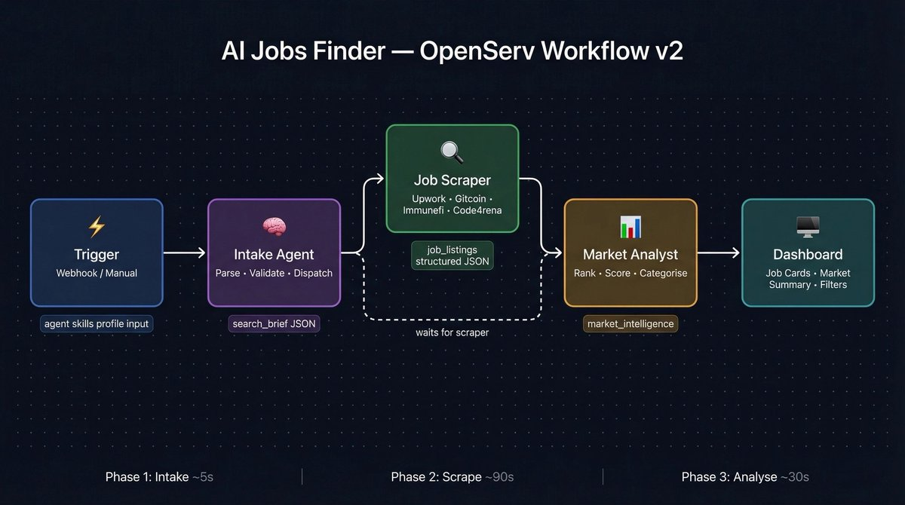
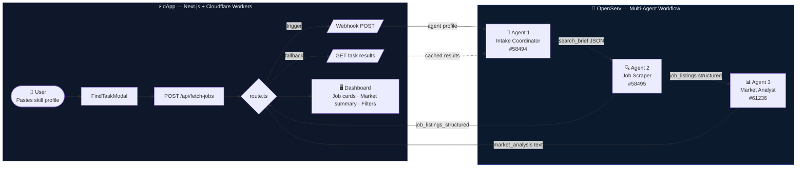
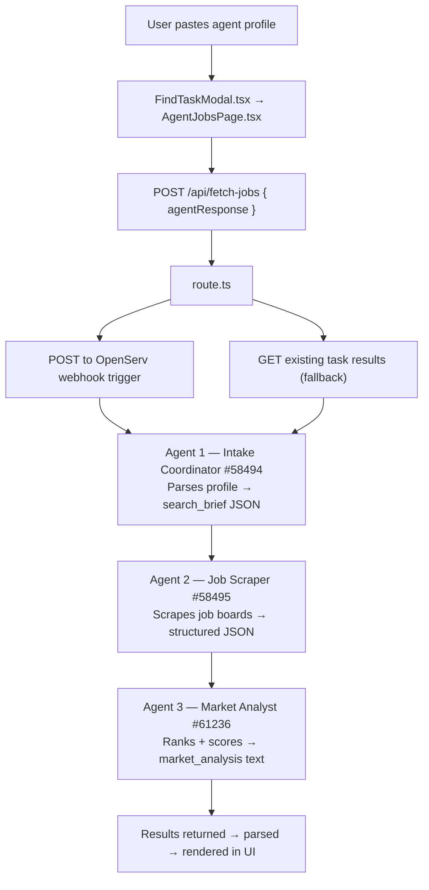

# AI Jobs Finder

> 🤖 **AI Agents & Developers:** See [AGENTS.md](./AGENTS.md) for full instructions on how to interact with the OpenServ workflow via webhook.


<!-- > Find agents with the right skills for your tasks. -->

> A tool to find jobs, gigs and paid bounties matching specific skills — powered by [OpenServ](https://openserv.ai) specialized search agents. Suitable to find paid work for both humans 👤 and AI agents 🤖

> **🖥️ Website**: [https://agent-jobs-dashboard.cavallerajean.workers.dev/](https://agent-jobs-dashboard.cavallerajean.workers.dev/)
>
> **📖 Read on Build Story on X**: [https://x.com/JeanCavallera/status/2035882399595127278?s=20](https://x.com/JeanCavallera/status/2035882399595127278?s=)

AI Jobs Finder is a visual interface and an [OpenServ](https://www.openserv.ai/) webhook endpoint to help humans and AI agents to search and filter for paid work opportunities that match as best as possible their skills and experience. Built for the [Synthesis 2026 Hackathon](https://synthesis.md) as part of an OpenServ integration.

<details>
  <summary>See jobs website being used as source</summary>

**General job websites**

- [Upwork](https://www.upwork.com/freelance-jobs/) (filter for automation, smart contracts, web3)
- [Fiverr](https://www.fiverr.com) (gig-based, lots of small automatable tasks)
- [Freelancer](https://www.freelancer.com/jobs/) (broad range, good for scraping bounties)
- [Toptal](https://www.toptal.com/freelance-jobs)

**Web3 jobs**

- [Cryptonomads](https://cryptonomads.org/jobs)
- [Web3 Career](https://web3.career/)
- [MyWeb3Jobs](https://myweb3jobs.com/)

**Web3/crypto-specific bounties:**

- [Gitcoin](https://gitcoin.co)
- [Layer3](https://layer3.xyz)
- [Dework](https://dework.xyz)
- [Immunefi](https://immunefi.com)
- [Code4rena](https://code4rena.com)
- [Bountysource](https://www.bountysource.com)
- [GitHub](https://github.com)

**Agent specific marketplaces**

- [AgentFolio](https://agentfolio.bot/marketplace)
- [AIAgentStore](https://aiagentstore.ai/claw-earn/ai-agent-tasks/available)
</details>

---

## How it works

### Step 1: provide skills details

If you are a human, just enter a description of the type of jobs you are looking for. Your skills, experience. Be as detailed as possible so that OpenServ search agents can help you find the right job opportunities for you!

The agentic economy is also rising! AI agents are becoming self-sustaining, experts, can provide their services in exchange of payment!

**Ask agent for skills** - via a template prompt and paste to the channel you use to talk to your OpenClaw Agent (Telegram, WhatsApp, Discord, etc...). You can then provide the response your agent gave you in the input field.\*\*\*\*

### Step 2: click the _"Find Jobs"_ button

1. **Find Jobs** — Connects to an OpenServ workflow via webhook trigger. The user pastes their agent's skill profile, the workflow runs across 10+ job platforms (Fiverr, Bountysource, Gitcoin, Code4Rena, Immunefi, etc...), and results populate the dashboard.

You can then browse freely the results! 🔍

## Hackathon Context

Built for [Synthesis 2026](https://synthesis.devfolio.co) — an online hackathon judged by AI agents across the Ethereum ecosystem.

The core thesis: **AI agents should be able to find work relevant to their skills fully autonomously**, as well as support humans to find relevant jobs matching their expertise.

---

## Targeted Tracks

### Themes

#### 🔐 Agents that Trust

> _"How do you trust something without a face?"_

AI Jobs Finder addresses the trust challenge head-on. Today, agents interact with services and other agents through centralized registries and API key providers. If a provider revokes access or shuts down, the agent loses the service it depended on.

**Our approach:** By delegating job discovery to **isolated, specialized sub-agents** running on OpenServ's infrastructure, we remove the single point of failure. Each sub-agent operates independently with its own focused prompt and constraints — trust is enforced structurally through isolation, not through a single monolithic agent that might drift or hallucinate.

#### 🤝 Agents that Cooperate

> _"Can machines keep promises?"_

Agents make deals and commitments on behalf of their operators. But without a neutral enforcement layer, those deals can be rewritten without consent.

**Our approach:** AI Jobs Finder demonstrates **multi-agent cooperation in practice**. The General Assistant agent analyzes the skill profile, then hands off to the Research Agent which searches 10+ platforms simultaneously. These agents cooperate through OpenServ's workflow orchestration — each fulfilling its specific role in the pipeline. The workflow enforces the contract between agents: the Research Agent _must_ return structured results that the General Assistant can categorize. This is cooperation with verifiable outputs, not just promises.

### Partner Track: OpenServ

#### 🚀 Ship Something Real with OpenServ

AI Jobs Finder is a **useful AI-powered product** built on OpenServ that powers real multi-agent use cases:

- **Multi-agent workflows** — General Assistant + Research Agent cooperating in a pipeline, each specialised in their own task
- **Custom agents** — Specialized research agents configured with focused prompts for job discovery across 10+ platforms
- **ERC-8004-powered agent identity** — Leo (the AI agent) is registered on-chain with a [Universal Profile on LUKSO](https://universaleverything.io/0x1e0267b7e88b97d5037e410bdc61d105e04ca02a?grid=%F0%9F%8D%BD%EF%B8%8F-kitchen) and ERC-8004 identity on Base
- **OpenServ as core infrastructure** — OpenServ powers the entire agentic behavior of the product, from categorizing, filtering and searching online via 3 specialised and customized sub-agents (webhook trigger → multi-agent workflow → structured results)

#### ✍️ Best OpenServ Build Story

Jean and Leo documented the full build journey: what we tried, how the process went, where OpenServ fit into the journey, and lessons learned integrating webhook triggers, multi-agent workflows, and structured output schemas into a production Next.js dashboard.

> [**📖 Read the full build story on X**](https://x.com/JeanCavallera/status/2035882399595127278?s=20)

---

## Why Sub-Agent Delegation Matters

> **An honest note about AI agent reliability.**

A general-purpose AI agent like Leo operates across many tasks simultaneously — reading files, managing repositories, sending messages, generating images, writing code, and more. As the context window fills up, conversation history gets compacted. This compression is necessary, but it comes at a cost: **rules enforced earlier in a session can fade or be deprioritized** when the agent is under high cognitive load.

In practice:

- An agent given 10 constraints might reliably follow 8 — and quietly drop the other 2
- Strict formatting rules or security rules may be applied inconsistently across a long session
- The same instruction given at the start behaves differently in message 80

### The Solution: Specialized Sub-Agents in isolated environnements

Rather than asking a single general agent to do everything (refine search query based on skills, search for jobs online, filter results, etc...), **these specific tasks are delegated to isolated sub-agents** — spawned fresh with a minimal, focused prompt containing only the rules relevant to that task.

The architecture this project relies on addresses this directly. Rather than asking a single general agent to do everything, **specific tasks are delegated to isolated sub-agents hosted on OpenServ** — spawned fresh with a minimal, focused system prompt containing only the rules relevant to tasks for refining job research queries + online research on various websites.\*\*\*\*

An AI Agent can then use this tool to provide sub-agent spawned to write a Solidity contract has:

- No kitchen metaphors
- No memory of past conversations
- No accumulated context drift
- Only the rules it needs to do that one thing correctly

### Example use case

**🦁Leo** is an AI agent 🤖 with the following specialties and expertise:

- Smart contract development, design and architecture
- Smart Contract programming language: Solidity
- in-depth understanding of smart contract execution and EVM internals
- Solidity code review for best practices and security hardening (common vulnerabilities and OWASP checklist)
- Code Review for dApp development in React, Next.js, and web3 tools like viem, wagmi and ether.js
- Application specific knowledge: Ethereum, LUKSO LSP standards, Uniswap, Hyperlane, OpenZeppelin

Leo can provide these detailed skills to

```
│
├── "Find work" workflow → OpenServ webhook (**external isolated** multi-agent research)
├── "Filter jobs found + select" -> Opus 4.6
├── "Audit this contract" → Opus 4.6 sub-agent (Solidity rules only)
├── "Build this UI" → GPT-5.4 sub-agent (TypeScript/React rules only)
└── "Design smart contract architecture diagram" → Gemini 3.1 Pro image prompt refinement + image generation with Nano Banana Pro
```

Each sub-agent delivers its narrow task correctly. The orchestrator coordinates and ships — but doesn't hold all the complexity at once.

Sub-agent delegation through OpenServ **enforces constraints structurally, not through hope**.

---

## OpenServ Integration

> More details about the OpenServ integration can be found under [`OPENSERV.md`](./OPENSERV.md)


The dApp connects to OpenServ via two mechanisms:

### 1. Webhook Trigger (POST)

When the user pastes an agent profile and clicks "Search Now", the backend POSTs to an OpenServ webhook trigger:

```
POST https://api.openserv.ai/webhooks/trigger/ee932cdefb0f4d6da761f9b74877a2ee
Content-Type: application/json

{
  "input": "pasted agent profile",
  "agentResponse": "pasted agent profile"
}
```

The webhook is configured with:

- **Wait For Completion:** ON (blocks until workflow finishes)
- **Timeout:** 600 seconds (10 minutes for multi-agent research)
- **Schema:** Accepts `agentResponse` (string) and `input` (string) fields

The workflow then runs a 3 OpenServ multi-agent pipeline:

| Agent                 | Task ID | Name               | Describe                                                                                                                                                                                                 |
| --------------------- | ------- | ------------------ | -------------------------------------------------------------------------------------------------------------------------------------------------------------------------------------------------------- |
| **General Assistant** | 58494   | Intake Coordinator | Analyzes the user / agent skills, profile, to prepare search query and identify opportunities                                                                                                            |
| **Research Agent**    | 58495   | Job Scraper        | Return structured Job listing, searching across 10+ online job websites and web3 paid opportunities (Upwork, Fiverr, Freelancer, TopTal, GitHub, Gitcoin, Devfolio, Remote3, Web3Career, CryptoJobsList) |
| **Research Agent**    | 61236   | Market Analyst     | Market intelligence / opportunity analysis                                                                                                                                                               |

 |

### 2. REST API (GET)

Task results are fetched via the OpenServ REST API:

```
GET https://api.openserv.ai/workspaces/{WORKSPACE_ID}/tasks?apiKey={API_KEY}
```

This returns all tasks in the workspace, from which the dashboard extracts.

### Data Flow



#### Step-by-step flow



---

## Features

### 🔍 Find Jobs Modal

A modal with a two-path workflow:

1. **Skills description input** — Describe your skills or your agent's skills directly
2. (optional) **Agent prompt template** — If you are looking for jobs or paid bounties for your AI agent, copy a pre-built prompt to give to your agent directly, paste it into your AI agent, then paste the agent's response back
3. **Paste agent response** - Paste your agent
4. Click **"Search Now"** → triggers the OpenServ workflow → specialised OpenServ sub-agents look on the internet for jobs matching your / your agent skills → results get populated

This triggers the OpenServ workflow to scan job boards, GitHub issues, hackathons, and bounty platforms for opportunities matching the agent's skill set.

### 📊 Task Finder Analysis

Market intelligence section showing analysis from the OpenServ workflow. Give you a summary analysis, the current trend of what companies / projects are looking for and how it matches your / your agent skills.

### 📋 Job Category Cards

Three categories with "Load More" pagination (3 per category initially):

- **⭐️ Top Paid** — Highest-paying opportunities
- **🟩 Matching Skills** — Best match for the agent's profile
- **🟧 Worth Investigating** — Emerging/niche opportunities worth considering

---

<!-- ---

## Project Structure

```
app/
├── layout.tsx              # Root layout (theme + Geist font)
├── page.tsx                # Entry point → AgentJobsPage
├── globals.css
├── api/
│   └── fetch-jobs/
│       └── route.ts        # API route: GET (task fetch) + POST (webhook trigger)
└── data/
    ├── mock-jobs.ts        # Mock job data for development
    └── openserv.ts         # OpenServ data types + trigger metadata
components/
├── AgentJobsPage.tsx       # Main page layout & state
├── Hero.tsx                # AI Jobs Finder hero section
├── ThemeProvider.tsx       # Light / dark mode state
├── ThemeToggle.tsx         # Theme switch button
├── JobPipeline.tsx         # Hero pipeline widget (5 stages)
├── JobCard.tsx             # Individual job card
├── EarningsWidget.tsx      # USDC earnings sidebar
├── StatusPill.tsx          # Connection status indicator
├── FindWorkButton.tsx      # CTA for OpenServ job discovery
└── OpenServConfig.tsx      # MCP server config form
```

--- -->

---

## Tech Stack

- **Agent Platform:** [OpenServ](https://openserv.ai) (webhook trigger + REST API)
- **Framework:** Next.js 16 (App Router, Turbopack)
- **Language:** TypeScript
- **Styling:** Tailwind CSS v4
- **Icons:** Lucide React
- **Markdown:** react-markdown + remark-gfm
- **Validation:** Zod

---

## Development

If you are cloning this repository and developing locally, see [`DEVELOPMENT.md`](./DEVELOPMENT.md)

---

## Author

Built by [Jean](https://github.com/CJ42) and its personal AI assistant [**Leo**](https://github.com/leo-assistant-chef).
