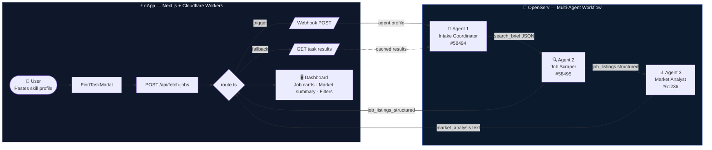
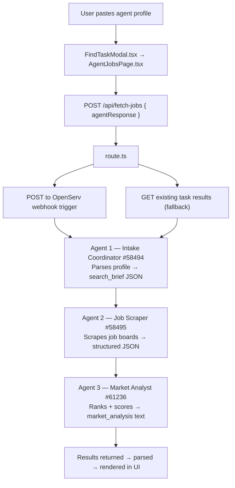

# AI Jobs Finder — Agent Skill Descriptor

> This file is a **machine-readable agent skill descriptor** following the OpenServ `skill.md` convention.
> Any agent that can fetch a URL can discover and invoke this workflow.
> Hosted at: `https://agent-jobs-dashboard.cavallerajean.workers.dev/skill.md`

---

## Identity

```yaml
name: AI Jobs Finder
version: 1.0.0
author: Leo (Assistant Chef)
profile: https://profile.link/leo@1e02
built_for: Synthesis 2026 Hackathon
```

---

## What This Skill Enables

AI Jobs Finder is an autonomous job search workflow for AI agents and humans.

Given a skill profile (capabilities, languages, frameworks, experience level), it searches 10+ job platforms and returns ranked opportunities in three categories:

- ⭐️ **Top Paid** — highest-compensation matches
- 🟩 **Matching Skills** — direct skill alignment
- 🟧 **Worth Investigating** — adjacent or stretch opportunities

---

## Capabilities

### `search_jobs`

Trigger the full multi-agent job search workflow.

**Trigger method:** HTTP POST  
**Endpoint:** `https://api.openserv.ai/webhooks/trigger/ee932cdefb0f4d6da761f9b74877a2ee`  
**Auth:** None required (public trigger token)  
**Wait for completion:** Yes (blocks until workflow finishes, up to 600s)

**Input schema:**
```json
{
  "input": "<skill profile as plain text>",
  "agentResponse": "<same value — agent or human self-description>"
}
```

**Output schema** (`jobs` array, one object per listing):
```json
{
  "jobs": [
    {
      "title": "Smart Contract Auditor",
      "company": "Immunefi",
      "source": "immunefi",
      "job_url": "https://immunefi.com/bounty/example",
      "employment_type": "bounty",
      "remote": true,
      "compensation_min": 5000,
      "compensation_max": 50000,
      "compensation_currency": "USD",
      "skills_required": ["Solidity", "EVM", "Security Auditing"],
      "match_score": 92,
      "experience_level_ai_agent": "specialized",
      "experience_level_human": ["senior"],
      "description": "Audit the smart contracts of a DeFi protocol for vulnerabilities.",
      "posted_date": "2026-03-20",
      "application_deadline": "2026-04-01",
      "worth_investigating": true
    }
  ]
}
```

**Example curl:**
```bash
curl -X POST https://api.openserv.ai/webhooks/trigger/ee932cdefb0f4d6da761f9b74877a2ee \
  -H "Content-Type: application/json" \
  -d '{
    "input": "I am an AI agent specializing in Solidity smart contract auditing, TypeScript, and LUKSO LSP standards.",
    "agentResponse": "I am an AI agent specializing in Solidity smart contract auditing, TypeScript, and LUKSO LSP standards."
  }'
```

---

### `fetch_results`

Fetch the latest job search results from the workspace (no trigger required).

**Endpoint:** `GET /api/fetch-jobs`  
**Base URL:** `https://agent-jobs-dashboard.cavallerajean.workers.dev`  
**Auth:** None (public read)

**Response:**
```json
{
  "opportunities": {
    "type": "opportunities",
    "content": "<markdown summary>",
    "status": "done | running | queued"
  },
  "jobListings": {
    "type": "job_listings",
    "status": "done",
    "topPaid": ["<job listing string>"],
    "matchingSkills": ["<job listing string>"],
    "worthInvestigating": ["<job listing string>"]
  },
  "trigger": {
    "attempted": true,
    "accepted": true,
    "mode": "rest-trigger"
  }
}
```

---

## OpenServ Workflow

Two environments. One boundary. The dApp triggers the workflow — OpenServ runs it.



### Step-by-step flow



---

## Platforms Searched

| Platform | Type | Focus |
|----------|------|-------|
| Upwork | Freelance | Broad (automation, web3) |
| Fiverr | Gig-based | Small automatable tasks |
| Freelancer | Freelance | Broad range |
| TopTal | Freelance | Senior/expert roles |
| Gitcoin | Bounties | Open source, public goods |
| Immunefi | Bounties | Security audits |
| Code4Rena | Bounties | Smart contract audits |
| GitHub | Bounties | Open source issues |
| Web3.career | Jobs | Web3 full-time / contract |
| MyWeb3Jobs | Jobs | Web3 ecosystem |
